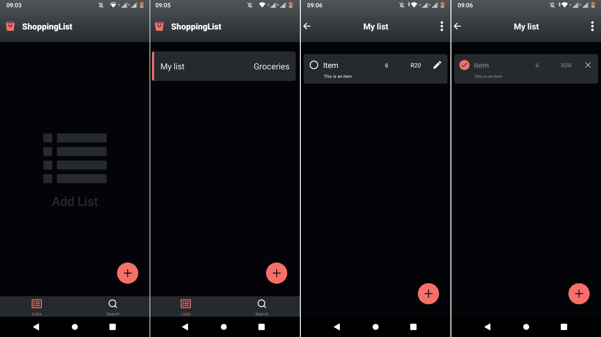

# Shopping List App

React Native Shopping List App using SQLite as database.

## Prerequisites

- React Native
- Expo

## Installation

1. Clone the repository

```bash
git@github.com:Lspacedev/shop-list-app.git
```

2. Navigate to the project folder

```bash
cd shop-list-app
```

3.  Install all dependencies

```bash
npm install
```

3. Run the project

```bash
npx expo start
```

In the output, you'll find options to open the app in a

- [development build](https://docs.expo.dev/develop/development-builds/introduction/)
- [Android emulator](https://docs.expo.dev/workflow/android-studio-emulator/)
- [iOS simulator](https://docs.expo.dev/workflow/ios-simulator/)
- [Expo Go](https://expo.dev/go), a limited sandbox for trying out app development with Expo

## Screenshot



## Features

- Create a shopping list.
- Delete shopping list.
- Update shopping list.

- Add items to shopping list.
- Update shopping list item.
- Mark shopping list item as completed
- Delete shopping list items

- Search lists.

## Usage

1. Open the app.
2. Create new list.
3. Create items in list.

## Tech Stack / Tools

- React Native
- Expo
- SQLite
